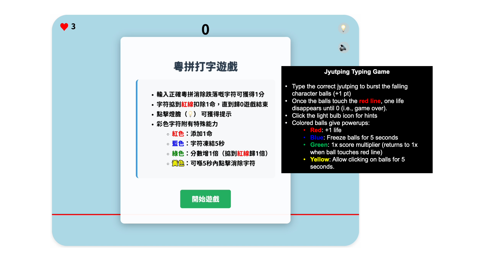
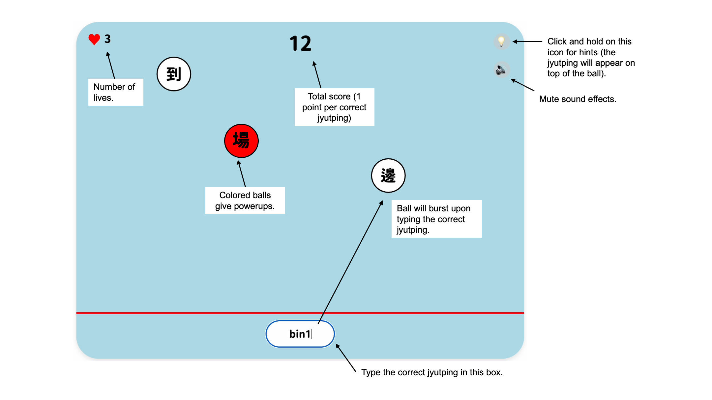
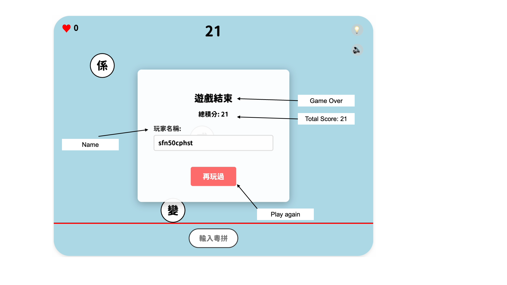

# 粵拼打字遊戲 (Jyutping Typing Game)

A fun and educational typing game that helps players learn Cantonese Jyutping (粵拼) through interactive gameplay. Players type the correct Jyutping romanization for falling Chinese characters to score points and avoid losing lives.

Try the game [here](https://rutherz34.github.io/cantonesetypinggame/)!

## Screenshots

Starting Page:


Gameplay:


Game over:



## 🎮 Features

### Core Gameplay
- **Interactive Typing**: Type Jyutping for falling Chinese characters
- **Scoring System**: Earn points for correct answers
- **Life System**: Lose lives when characters reach the red line
- **Power-ups**: Special colored characters with unique abilities
  - 🔴 **Red**: Gain an extra life
  - 🔵 **Blue**: Freeze all characters for 5 seconds
  - 🟢 **Green**: Double your score multiplier
  - 🟡 **Yellow**: Click to destroy characters for 5 seconds

### Educational Features
- **Jyutping Learning**: Built-in guide with all Jyutping rules
- **Character Database**: Comprehensive collection of common Cantonese characters
- **Tone System**: Learn all 6 Cantonese tones
- **Examples**: Practical examples with Jyutping

### Technical Features
- **Responsive Design**: Works on desktop, tablet, and mobile devices
- **Scoreboard System**: Track high scores with persistent storage
- **Sound Effects**: Immersive audio feedback
- **Modern UI**: Clean, intuitive interface with smooth animations

## 🚀 Quick Start

### Prerequisites
- Node.js (v14 or higher)
- npm or yarn

### Installation

1. **Clone the repository**
   ```bash
   git clone https://github.com/yourusername/jyutping-typing-game.git
   cd jyutping-typing-game
   ```

2. **Install dependencies**
   ```bash
   npm install
   ```

3. **Start the server**
   ```bash
   npm start
   ```

4. **Open the game**
   - Navigate to `http://localhost:3001` in your browser
   - The game will load automatically

### Development Mode
```bash
npm run dev
```
This will start the server with nodemon for automatic restarts during development.

## 🎯 How to Play

### Basic Controls
- **Type Jyutping**: Enter the correct Jyutping for falling characters
- **Press Enter**: Submit your answer
- **Click Characters**: During yellow power-up, click characters to destroy them
- **Hint System**: Click the lightbulb icon for hints

### Scoring
- **Correct Answer**: +1 point
- **Character Hits Red Line**: -1 life
- **Power-ups**: Various bonuses and abilities
- **Game Over**: When lives reach 0

### Jyutping Rules
The game includes a comprehensive guide covering:
- **Initials** (聲母): b, p, m, f, d, t, n, l, g, k, ng, h, gw, kw, w, j, z, c, s
- **Finals** (韻母): aa, aai, aau, aam, aan, aang, aap, aat, aak, ai, au, am, an, ang, ap, at, ak
- **Tones** (聲調): 6 tones with examples

## 🛠️ Technology Stack

### Frontend
- **HTML5**: Semantic markup
- **CSS3**: Modern styling with responsive design
- **JavaScript (ES6+)**: Game logic and interactions
- **p5.js**: Canvas-based game rendering
- **Local Storage**: Client-side score persistence

### Backend
- **Node.js**: Server runtime
- **Express.js**: Web framework
- **SQLite3**: Lightweight database for scores
- **CORS**: Cross-origin resource sharing

### Dependencies
```json
{
  "express": "^4.18.2",
  "cors": "^2.8.5",
  "sqlite3": "^5.1.6",
  "body-parser": "^1.20.2"
}
```

## 📁 Project Structure

```
jyutping-typing-game/
├── index.html              # Main game page
├── styles.css              # Game styling
├── play.js                 # Main game logic
├── ball.js                 # Character ball physics
├── characters.js           # Character database
├── navigation.js           # Modal and scoreboard logic
├── server.js               # Backend server
├── package.json            # Dependencies and scripts
├── scores.db               # SQLite database
├── fonts/                  # Custom fonts
│   └── GenSenRounded-*.ttf
├── sounds/                 # Game audio
│   ├── gameover.mp3
│   ├── pop.mp3
│   ├── powerup.mp3
│   └── dead.mp3
└── README.md               # This file
```

## 🎨 Customization

### Adding New Characters
Edit `characters.js` to add new characters:
```javascript
{
    character: '字',
    jyutping: 'zi6',
    frequency: 1
}
```

### Modifying Game Settings
Adjust game parameters in `play.js`:
```javascript
const CONFIG = {
    CANVAS_WIDTH: 800,
    CANVAS_HEIGHT: 600,
    BALL_SPEED: 1.5,
    BALL_SPAWN_INTERVAL: 2000,
    // ... more settings
};
```

### Styling Changes
Modify `styles.css` for visual customization:
- Color schemes
- Font sizes
- Layout adjustments
- Responsive breakpoints

## 🔧 API Endpoints

### Scoreboard API
- `GET /api/scores` - Retrieve top 100 scores
- `POST /api/scores` - Add new score
- `DELETE /api/scores` - Clear all scores (admin only)
- `GET /api/stats` - Get score statistics

### Example Usage
```javascript
// Get scores
fetch('http://localhost:3001/api/scores')
  .then(response => response.json())
  .then(scores => console.log(scores));

// Add score
fetch('http://localhost:3001/api/scores', {
  method: 'POST',
  headers: { 'Content-Type': 'application/json' },
  body: JSON.stringify({ name: 'Player', score: 100 })
});
```

## 🐛 Troubleshooting

### Common Issues

**Game won't start**
- Check if server is running on port 3001
- Ensure all files are in the correct directory
- Check browser console for JavaScript errors

**Scores not saving**
- Verify database file permissions
- Check server logs for database errors
- Ensure CORS is properly configured

**Audio not working**
- Modern browsers require user interaction before playing audio
- Check if audio files are in the correct location
- Verify audio file formats are supported

### Debug Mode
Enable debug logging in the browser console:
```javascript
localStorage.setItem('debug', 'true');
```

## 🤝 Contributing

We welcome contributions! Please follow these steps:

1. Fork the repository
2. Create a feature branch (`git checkout -b feature/amazing-feature`)
3. Commit your changes (`git commit -m 'Add amazing feature'`)
4. Push to the branch (`git push origin feature/amazing-feature`)
5. Open a Pull Request

### Development Guidelines
- Follow existing code style
- Add comments for complex logic
- Test on multiple devices
- Update documentation as needed

## 🙏 Acknowledgments

- **Hong Kong Language Society** for Jyutping romanization system
- **p5.js** community for the excellent graphics library
- **Cantonese speakers** worldwide for language preservation

## 📞 Contact

For feedback, questions, or support:
- **Email**: rutherz34@gmail.com
---

**Made with ❤️ for Cantonese language learning**

*Support Cantonese language preservation through interactive education!* 
